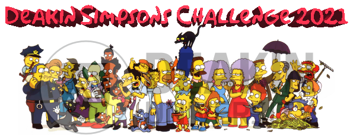
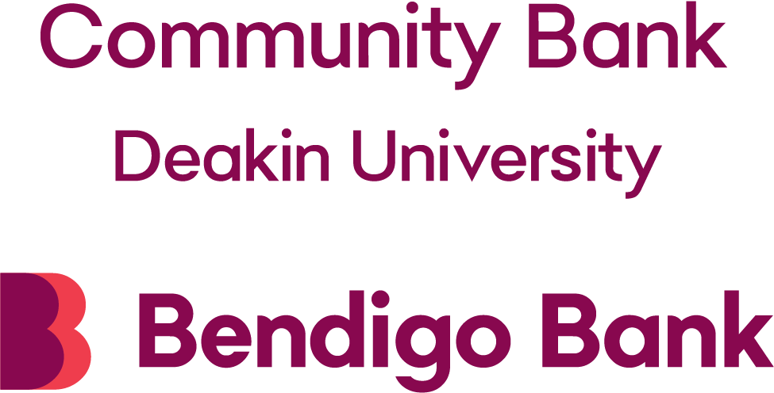

# Welcome to the Deakin Simpsons Challenge 2021

  

The **Deakin Simpsons challenge 2021** is a computer vision competition for which the goal is to recognize Simpsons characters individually in images using machine learning and deep learning. The challenge is designed to provide students with the opportunity to work as team members, to compete with each other, and to enhance the student learning experience by improving their AI modeling, problem-solving, and team-working skills.

# Table of Contents
1. [About the task](#introduction)
2. [Winners](#winners)
3. [Timeline](#Timeline)
4. [Eligibility](#Eligibility)
5. [Prizes and Sponsors](#Sponsors)
6. [Benefit](#Benefit)
7. [Participate](#participate)
8. [Webinar](#Webinar)
9. [Questions](#Questions)
10. [References](#References)
11. [Acknowledgment](#Acknowledgment)

# About the task 

As participants, your goal is to build a machine learning model to automatically identify the following Simpsons characters:

<table>
<tr>
  <td> 1. <a href="https://en.wikipedia.org/wiki/Grampa_Simpson" target="_blank" > Abraham grampa Simpson</a> </td>
    <td>11.  <a href="https://simpsons.fandom.com/wiki/Lenny_Leonard" target="_blank" > Lenny Leonard </a> </td>
</tr>
<tr>
      <td> 2. <a href="https://en.wikipedia.org/wiki/Apu_Nahasapeemapetilon" target="_blank" > Apu Nahasapeemapetilon</a> </td>
    <td>12.  <a href="https://en.wikipedia.org/wiki/Lisa_Simpson" target="_blank" > Lisa Simpson </a> </td>
</tr>
<tr>
      <td> 3. <a href="https://en.wikipedia.org/wiki/Bart_Simpson" target="_blank" > Bart Simpson</a> </td>
    <td>13.  <a href="https://en.wikipedia.org/wiki/Marge_Simpson" target="_blank" > Marge Simpson </a> </td>
</tr>
<tr>
      <td> 4. <a href="https://en.wikipedia.org/wiki/Mr._Burns" target="_blank" > Charles Montgomery burns</a> </td>
    <td>14.  <a href="https://en.wikipedia.org/wiki/Mayor_Quimby" target="_blank" > Mayor Quimby </a> </td>
</tr>
<tr>
      <td> 5. <a href="https://en.wikipedia.org/wiki/Chief_Wiggum" target="_blank" > Chief Wiggum</a> </td>
    <td>15.  <a href="https://en.wikipedia.org/wiki/Milhouse_Van_Houten" target="_blank" > Milhouse Van Houten </a> </td>
</tr>
<tr>
      <td> 6. <a href="https://en.wikipedia.org/wiki/Comic_Book_Guy" target="_blank" > Comic Book Guy</a> </td>
    <td>16.  <a href="https://en.wikipedia.org/wiki/Moe_Szyslak" target="_blank" > Moe Szyslak </a> </td>
</tr>
<tr>
      <td> 7. <a href="https://en.wikipedia.org/wiki/Edna_Krabappel" target="_blank" > Edna Krabappel</a> </td>
    <td>17.  <a href="https://en.wikipedia.org/wiki/Ned_Flanders" target="_blank" > Ned Flanders </a> </td>
</tr>
<tr>
      <td> 8. <a href="https://en.wikipedia.org/wiki/Homer_Simpson" target="_blank" > Homer Simpson</a> </td>
    <td>18.  <a href="https://en.wikipedia.org/wiki/Nelson_Muntz" target="_blank" > Nelson Muntz </a> </td>
</tr>
<tr>
      <td> 9. <a href="https://en.wikipedia.org/wiki/Kent_Brockman" target="_blank" > Kent Brockman</a> </td>
    <td>19.  <a href="https://en.wikipedia.org/wiki/Principal_Skinner" target="_blank" > Principal Skinner </a> </td>
</tr>
<tr>
      <td> 10. <a href="https://en.wikipedia.org/wiki/Krusty_the_Clown" target="_blank" > Krusty the Clown</a> </td>
    <td>20.  <a href="https://en.wikipedia.org/wiki/Sideshow_Bob" target="_blank" > Sideshow bob </a> </td>
</tr>
</table>

To achieve this task, you will be given a data set that consists of 19,548 labeled images to train your model and tune your hyperparameters. However, feel free to extend it by collecting new images or by using data augmentation techniques.

Once you have built your model, you will have to submit it on the [CodaLab](https://competitions.codalab.org/competitions/27191?secret_key=f0a7cc3e-7f78-4bb1-8564-95bc2fadafa5) platform to be evaluated. 
We evaluate the performance of your model using the [Accuracy](https://scikit-learn.org/stable/modules/generated/sklearn.metrics.accuracy_score.html)  on a private test set that we have directly collected and labeled from TV show episodes.
Once the evaluation completed, your entry will appear on the leaderboard to see your performance against other competitors.

In the Notebook that we provide for starting, we will take you through  a 6-step process to build a simple model to perform this task as follows:

1. `Setup the environment:` Thie first step consists of setting the environement and downloading the data.
2. `Preprocessing:` The second step is a preprocessing step that consists of resizing, plitting, and piping the input data.
3. `Exploring the data:` The third step consists of a simple data exploration step where you will see samples of the data and some statistics to help you in understanding the data.
4. `Designing the model:` The forth step consists of designing an architecture for the task.
5. `Traning:` The fifth step consists of starting the training process.
6. `Monitoring:` The sixth step consists of monitoring the traning process to investigate possible overfitting.
7. `Submission:` The seventh and last step will take you through the submission process.

# Winners 

The winners of the competition are:
1. **ndhuynh** (Accuracy = 0.997) [[report](https://github.com/rbouadjenek/deakin-simpsons-challenge2021/blob/main/reports/ndhuynh.pdf)] [[code](https://github.com/parkerhuynh/Simpson-Charater-Detection)] 🥇
2. **peterja555** (Accuracy = 0.994) [[report](https://github.com/rbouadjenek/deakin-simpsons-challenge2021/blob/main/reports/peterja555.pdf)] [[code](https://github.com/pjasyd/Deakin_AI_Challenge_Code)] 🥈
3. **Bevan** (Accuracy = 0.991) [[report](https://github.com/rbouadjenek/deakin-simpsons-challenge2021/blob/main/reports/Bevan.pdf)] [[code](https://github.com/bevanyeah/deakin-simpsons-challenge2021)] 🥉
4. **Doh! Data** (Accuracy = 0.987) [[report](https://github.com/rbouadjenek/deakin-simpsons-challenge2021/blob/main/reports/Doh!%20Data.pdf)] [[code](https://github.com/joshanthony/simpsons-machine-learning-challenge)] 🎁
5. **vinayakam19** (Accuracy = 0.982) [[report](https://github.com/rbouadjenek/deakin-simpsons-challenge2021/blob/main/reports/vinayakam19.pdf)] [[code](https://github.com/Vinayakam19/Deakin-Simpsons-Challenge---2021)]
6. **Data Destroyers** (Accuracy = 0.965) [[report](https://github.com/rbouadjenek/deakin-simpsons-challenge2021/blob/main/reports/Data%20Destroyers%20.pdf)] [[code](https://github.com/SamAnast/Deakin-AI-Challenge)]

# Timeline 
- <s>`15.03.21:` Contest and Phase 1 Begin (Validation Leaderboard opens).</s>
- <s>`16.03.21:` [Join the Webinar at 5:30 PM to review procedures and for a live Q&A session](https://deakin-simpsons-challenge-2021.eventbrite.com).</s>
- <s>`15.05.21:` Phase 2 Begin (Testing Leaderboard opens) 🚨 **ONLY TWO SUBMISSIONS IS ALLOWED FOR THE TEST PHASE! PLEASE MAKE SURE TO SUBMIT YOUR BEST MODEL FROM  PHASE 1!** 🚨.</s>
- <s>`22.05.21:` Last Shot & Contest End (Testing Leaderboard closes).</s>
- <s>`23.05.21:` Semi-Finalists Announcement (top six teams on the Testing Leaderboard).</s>
- <s>`05.06.21:` Report & Code Due.</s>
- <s>`17.06.21:` Winners Announcement.</s>

# Eligibility

The competition is open to all Deakin's students enrolled in a course within the School of IT. Also, in order to be eligible for any award, the semi-finalists are required to:

- 🚨 Achieve at least **80%** accuracy for the test phase.
- 🚨 Submit a report, which describes the solution by the stipulated deadline  (4 pages **maximum**, using the [Master Article Template – LaTeX](https://www.overleaf.com/latex/templates/acm-conference-proceedings-master-template/pnrfvrrdbfwt), with the “sigconf” option). Please use the following [easychair link](https://easychair.org/conferences/?conf=deakinsimpsonschallenge2021) to submit your report. The reports will eventually be made publicly available on the website.
- 🚨 Provide a link of the Github repo of the solution in the report. The submitted codes and reports may be inspected to check the validity of the solution. 

# Prizes and Sponsors

The winners of the **Deakin Simpsons Challenge 2021** await non-cash prizes worth **AUD1,000** funded by [Community Bank at Deakin University](https://www.bendigobank.com.au/community/universities/community-bank-deakin-university/). 

The prizes will be distributed among the participants as follows:

- The 1st Place receives a non-cash prize equivalent of **AUD500**.
- The 2nd Place receives a non-cash prize equivalent of **AUD300**.
- The 3rd Place receives a non-cash prize equivalent of **AUD200**.
-   The 4th Place will also receive a non-cash prize equivalent of **AUD100** funded by the School of IT.

<!---
The prize money for the challenge is funded by [Deakin University CommUNIty Bank](https://www.bendigobank.com.au/community/universities/community-bank-deakin-university/), Australia.
--->
<!---

--->

# Why should you participate? 

Often, students work theoretically and experiment with data themselves. They rarely get the chance to practice before working with data in the real-world. With this competition, you have the opportunity to interact and compete in solving real-life problems.

This competition serves many purposes:

- First, it is the perfect place to learn best practices in AI, accrue feedback on your work, and augment your skills. 
- Second, it is a channel for problem-solving and brainstorming by probing the multitude of crowdsourced solutions to a problem.
- Third, this competition is an opportunity to push boundaries and encourage creativity among the best and the brightest in AI. 
- Fourth, the experience you get is invaluable in preparing you to understand what goes into finding feasible solutions for big data.
- Finally, in addition to the non-cash award that you will gain if you are on the podium (among the three winners), the school official award that will be given to you provides an invaluable recognition for the challenging work you will have achieved.  In particular, the award can raise your credibility as a PhD scholarship applicant or as a job seeker because your application will be viewed differently compared to other applicants and, as a result, you will be in a better position to receive more scholarship offers or job offers.

# Are you competitive enough to participate? 

Follow these steps:

1. Register to the [CodaLab](https://competitions.codalab.org/accounts/signup/?next=/) platform, then register to the competition on [CodaLab](https://competitions.codalab.org/competitions/27191?secret_key=f0a7cc3e-7f78-4bb1-8564-95bc2fadafa5).
3. You can participate individually or in a team. There cannot be more than 3 students in a team **(all team members need to register to the competition)**.
4. To find team members, you can post a message on the discussion forum on [CodaLab](https://competitions.codalab.org/competitions/27191?secret_key=f0a7cc3e-7f78-4bb1-8564-95bc2fadafa5). Once you have built your team, the team leader needs to contact [Mohamed Reda Bouadjenek](https://rbouadjenek.github.io/) with the names of the members, their **CodaLab usernames**, the Deakin course in which they are enrolled, and the name of the team.
5. Please [fork this GitHub repository](https://github.com/rbouadjenek/deakin-simpsons-challenge2020/fork) and make it **private**. Then, click [here to open the Notebook in Google Colab ](https://colab.research.google.com/github/rbouadjenek/deakin-simpsons-challenge2020/blob/main/deakin_ai_challenge_training.ipynb). 
6. Just follow the instructions!

We wish you all the best!

# Deakin Simpsons Challenge 2021 Webinar 

<s>JOIN the **Deakin Simpsons Challenge 2021** Webinar on **Tuesday, March 16th at 5:30 PM**. This webinar will review procedures and tips for participating and offer a live Q&A session with the challenge organizers and AI experts.</s>

<s>Please [register for the Webinar here](https://deakin-simpsons-challenge-2021.eventbrite.com)!</s>

[Link to the Webinar recording!](https://deakin.zoom.us/rec/share/SzysnTDdbbtbNLGbvINSjb88X1y_ESVse8woSYXSkM7OnZAjHe3irgO4SXAzLN2v.jH8n1TFQw1ee3cln)

# Questions?

- Please first go through all the pages in this competition for complete information.
- If you have further questions, please post them on the Forum tab.
- Alternatively, you can  contact [Mohamed Reda Bouadjenek](https://rbouadjenek.github.io/).

# References

- [The Simpsons characters recognition and detection using Keras](https://medium.com/alex-attia-blog/the-simpsons-character-recognition-using-keras-d8e1796eae36).
- [Image data preprocessing](https://keras.io/api/preprocessing/image/).
- [Pre-trained models](https://keras.io/api/applications/).

# Acknowledgment

The **Deakin Simpsons Challenge 2021** is organized by the [School of Information Technology](https://www.deakin.edu.au/information-technology), Faculty of Sci Eng & Built Env (SEBE) at [Deakin University](https://www.deakin.edu.au/).

  

The following people are involved:

- **[Mohamed Reda Bouadjenek](https://rbouadjenek.github.io/)** - Organization, technical design, development, and data preparation.
- **Peter Eklund** - technical design, and support to students.
- **Sunil Aryal** - technical design, and support to students.
- **Thuy Nguyen** - Organization and support.

**School of Information Technology, Faculty of Sci Eng & Built Env**

**Deakin University**

**Locked Bag 20000, Geelong, VIC 3220**

**www.deakin.edu.au**

  

